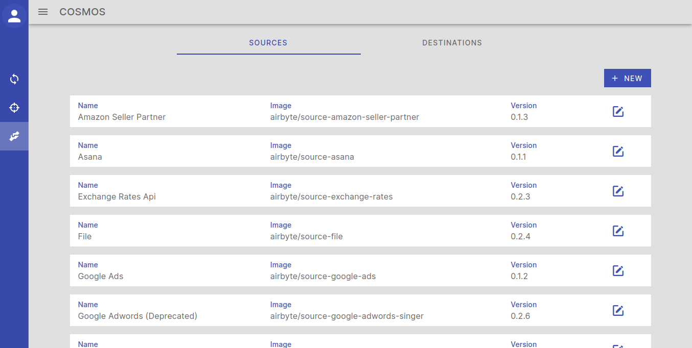
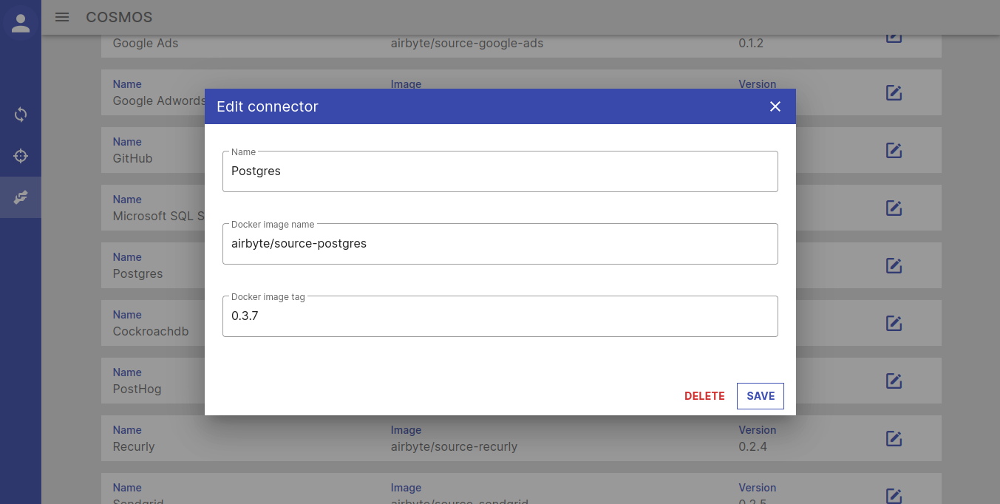
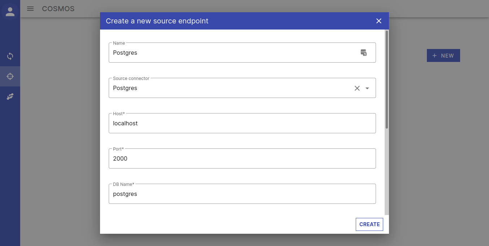
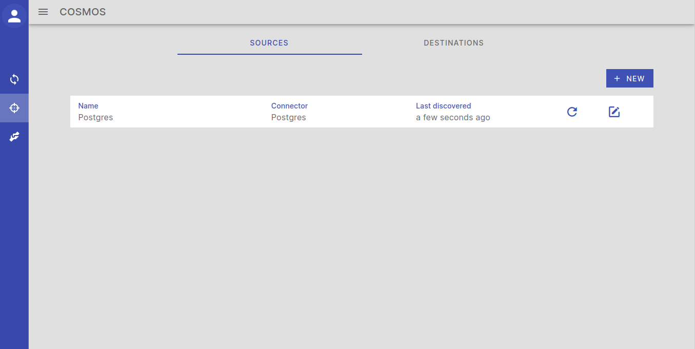
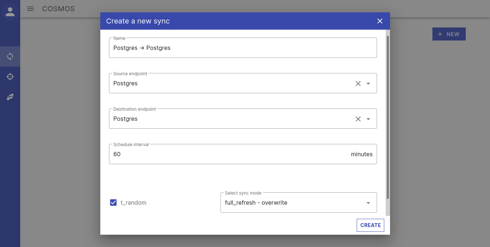
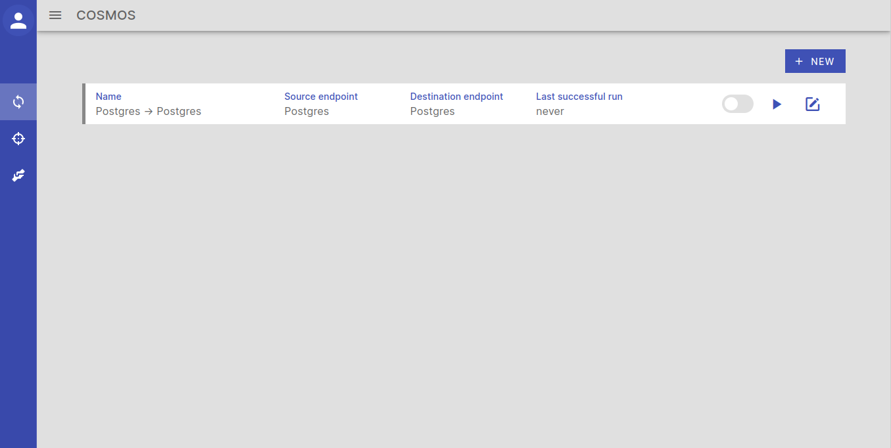
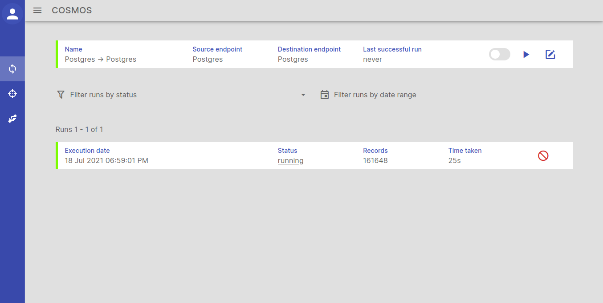
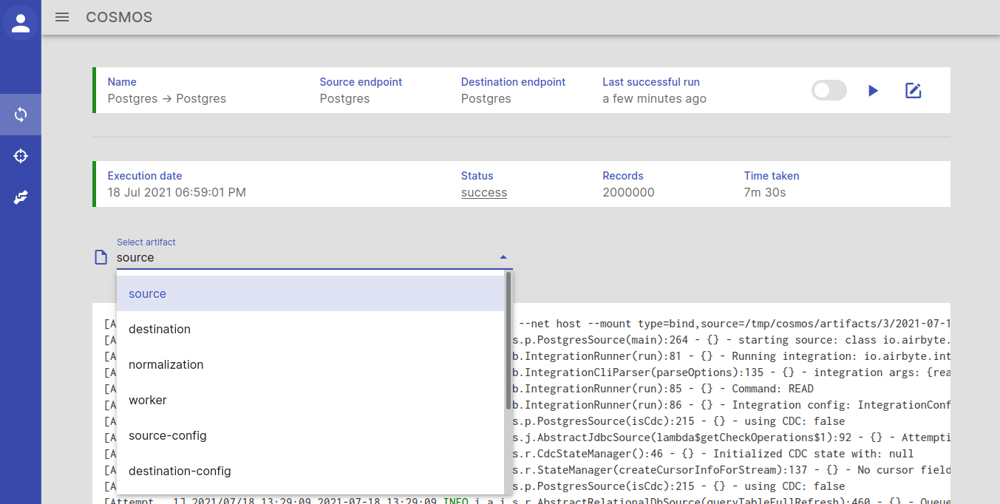
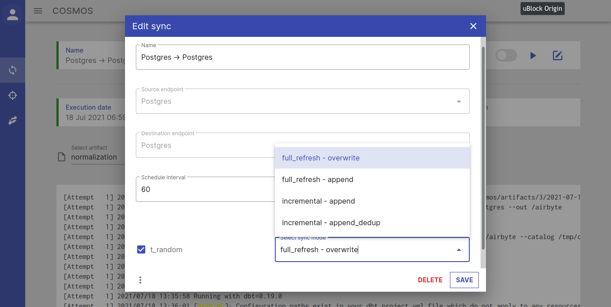
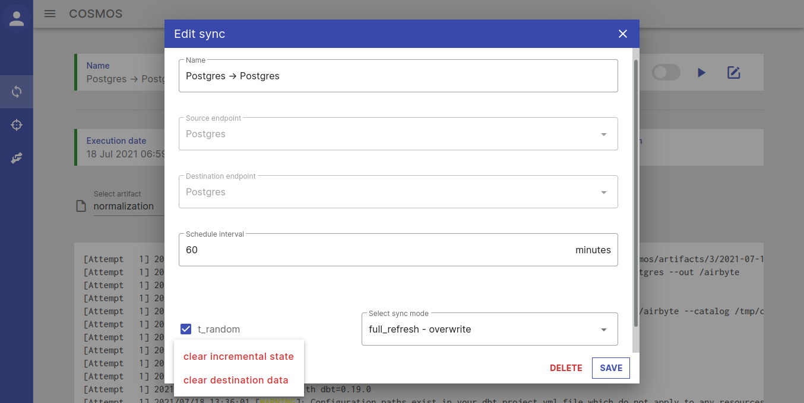

# COSMOS

An [Airbyte](https://github.com/airbytehq/airbyte) clone written in Go and Vue.js mainly as a hobby project.

Works with all Airbyte connectors (source and destination) out of the box.

Features a simpler and cleaner UI (see screenshots below).

## Why?

I started working on an Airbyte clone primarily to learn Go and Vue.js.

Along the way, I added a few nice touches to the UI.

## Tech stack

**Backend**: Golang

**Frontend**: [Vue](https://vuejs.org/) + [Vuetify](https://vuetifyjs.com/en/) (material design)

**Workflow orchestration**: [Temporal](https://temporal.io/)

## Concepts

| Name       | Description                                                                                                                                                                                                                                                        |
| ----       | -----------                                                                                                                                                                                                                                                        |
| Connectors | These are the usual Airbyte [connectors](https://docs.airbyte.io/integrations).                                                                                                                                                                                    |
| Endpoints  | Actual physical endpoints in your origanization. For example, a PostgreSQL server running at X.X.X.X:5432 is one *endpoint* while a PostgreSQL server running at Y.Y.Y.Y:5432 is a second *endpoint* although both endpoints make use of the Postgres *connector*. |
| Syncs      | A *sync* is nothing more than a connection between two *endpoints* describing the way that data should be replicated between those two *endpoints*.                                                                                                                    |

## Getting started

Run the application with docker-compose.

    $ git clone https://github.com/varunbpatil/cosmos.git
    $ cd cosmos
    $ docker-compose up

Wait for the the message "Accepting connections at http://localhost:5000" on the console.

The application is now ready to be used.

## Screenshot tour

The *Connectors* page comes pre-populated with all of Airbyte's source and destination connectors.

You also have the ability to add new connectors, delete unused connectors and
modify existing connectors with your own docker images and versions.

You start by creating source and destination *Endpoints*. You get fuzzy text
search in all dropdown boxes.

The page should be automatically updated in a few seconds after the *endpoint* is created.

The next step is to connect a source and destination *endpoint* pair with a *Sync*.

The page should automatically update in a few seconds after the *Sync* is
created. You can click on the **Enable Sync** toggle button to enable the sync
to run on a schedule or click the **Sync Now** button to start an ad-hoc sync.

Clicking on a sync will show you all the *runs* for that *sync*.

All *syncs* and their corresponding *runs* have a colored bar on the left to indicate completion status.

You can then filter *runs* based on their status or execution date.

You can also cancel a run in-between.

You also get to see a near-realtime update to the number of records being replicated.

Clicking on a particular *run* will show you the logs and other details for
that particular *run* in near-realtime.

You can also edit/delete *Endpoints* and *Syncs* (just like you can
*Connectors*) at any time by clicking on the **Edit Sync** or **Edit Endpoint**
buttons.

You can also clear state (for incremental syncs) and/or completely clear all
data on the destination by clicking on **Edit Sync** and then clicking on the
Kebab menu button (three vertical dots) on the bottom left of the dialog.

## License
MIT

## Thanks
Thanks to the Airbyte team and community for the awesome software and
connectors. What I've written is not a new product in any way, just a
reimagination.
